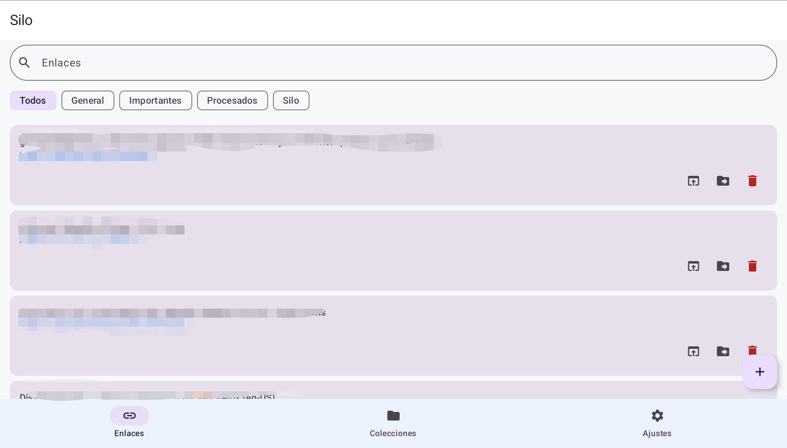
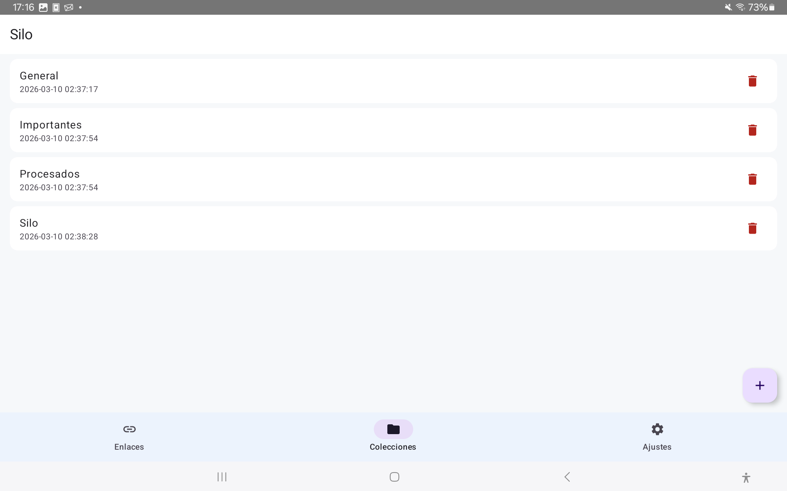
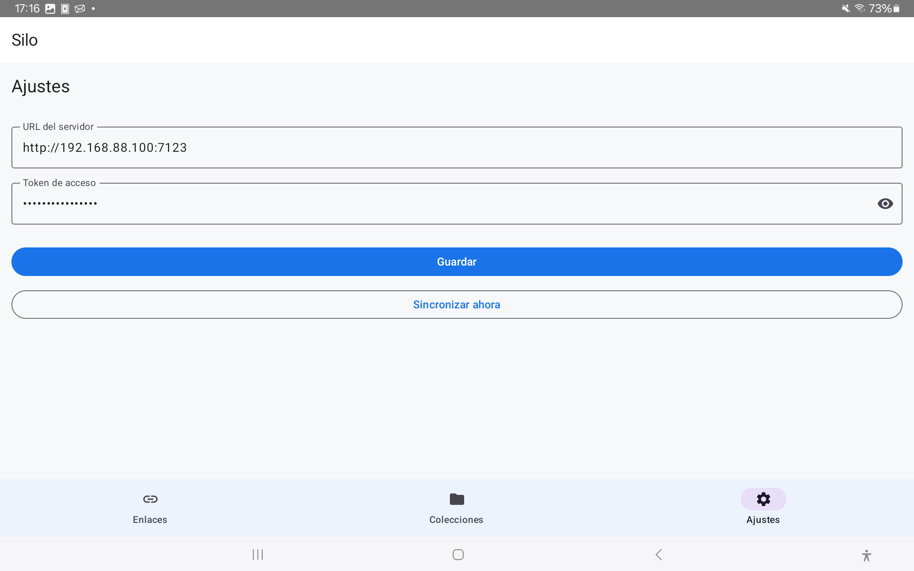

# Silo Android

Cliente Android para [Silo](https://codeberg.org/osdaeg/silo), el gestor de enlaces autoalojado. Funciona en modo **offline-first**: guardás enlaces aunque no tenés conexión y se sincronizan automáticamente cuando el servidor vuelve a estar disponible.


---

## Capturas





---

## Características

- 📋 **Lista de enlaces** con búsqueda en tiempo real y filtro por colección
- ➕ **Agregar enlaces** con fetch automático del título desde la URL
- 📁 **Colecciones** — creá, filtrá y organizá tus enlaces
- 🔗 **Menú compartir de Android** — guardá cualquier URL directamente desde el navegador u otras apps
- ☁️ **Offline-first** — los enlaces se guardan localmente aunque no haya servidor
- 🔄 **Sincronización automática** al recuperar la conexión de red
- 🔒 **Autenticación por token**

---

## Requisitos

- Android API 26 o superior (Android 8.0+)
- Servidor [Silo](https://codeberg.org/osdaeg/silo) corriendo en tu red local

---

## Instalación

### Compilar desde el código fuente

1. Cloná el repositorio:
```bash
git clone https://codeberg.org/osdaeg/silo-android.git
cd silo-android
```

2. Compilá el APK:
```bash
./gradlew assembleDebug
```

3. Instalá en el dispositivo:
```bash
adb install app/build/outputs/apk/debug/app-debug.apk
```

### Requisitos para compilar

- JDK 17
- Android Studio Hedgehog o superior
- Android SDK API 35
- Gradle 8.7

---

## Configuración

Al abrir la app por primera vez, andá a **Ajustes** e ingresá:

| Campo | Descripción |
|-------|-------------|
| URL del servidor | Ej: `http://192.168.1.10:7123` |
| Token de API | El token configurado en tu servidor Silo |

Luego apretá **Sincronizar** para traer tus enlaces.

---

## Cómo funciona el modo offline

| Acción | Con red | Sin red |
|--------|---------|---------|
| Agregar enlace | Sube al servidor y guarda en Room | Guarda localmente con ID temporal |
| Borrar enlace | Borra del servidor y de Room | Marca como pendiente de borrar |
| Sincronizar | Sube pendientes, luego refresca desde el servidor | — |

Los enlaces pendientes se identifican con el ícono ☁️ en la lista.

---

## Tecnologías

| Componente | Librería |
|------------|----------|
| UI | Jetpack Compose + Material 3 |
| Base de datos local | Room 2.6.1 |
| Inyección de dependencias | Hilt 2.51.1 |
| Red | Retrofit 2.11.0 + Moshi 1.15.1 |
| Preferencias | DataStore 1.1.1 |
| Sincronización | WorkManager 2.9.0 |
| Navegación | Navigation Compose 2.7.7 |

---

## Estructura del proyecto

```
app/src/main/java/com/daniel/silo/
├── SiloApp.kt
├── data/
│   ├── local/          # Room (entidades, DAOs, base de datos)
│   └── remote/         # Retrofit (DTOs, API, ApiProvider)
├── di/                 # Módulos Hilt
├── domain/
│   ├── model/          # Modelos de dominio
│   └── repository/     # SiloRepository (lógica offline-first)
├── sync/               # WorkManager + NetworkMonitor
└── ui/
    ├── MainActivity.kt
    ├── MainViewModel.kt
    ├── collections/
    ├── links/
    ├── settings/
    ├── share/
    └── theme/
```

---

## Parte del ecosistema Silo

| Cliente | Descripción |
|---------|-------------|
| [silo](https://codeberg.org/osdaeg/silo) | Servidor FastAPI + dashboard web |
| [silo-cli](https://codeberg.org/osdaeg/silo-cli) | Cliente de línea de comandos |
| [silo-tui](https://codeberg.org/osdaeg/silo-tui) | Interfaz de terminal (Python Textual) |
| [silo-plasmoid](https://codeberg.org/osdaeg/silo-plasmoid) | Widget para KDE Plasma 6 |
| [silo-firefox](https://codeberg.org/osdaeg/silo-firefox-extension) | Extensión para Firefox |
| **silo-android** | **App Android** ← estás aquí |

---

## Licencia

GPL v3
